Analysis of Dissolved Oxygen Data from Presumpscot Monitoring
================
Curtis C. Bohlen, Casco Bay Estuary Partnership
11/09/2021

-   [Introduction](#introduction)
-   [Maine’s Numeric Water Quality
    Standards](#maines-numeric-water-quality-standards)
-   [Import Libraries](#import-libraries)
-   [Import Data](#import-data)
    -   [Correct Probable Data Errors](#correct-probable-data-errors)
    -   [Create a “Surface Water Only” Ddata
        Set](#create-a-surface-water-only-ddata-set)
-   [List Sites for Specific
    Analyses](#list-sites-for-specific-analyses)
    -   [Trend Analysis](#trend-analysis)
    -   [Recent Sites](#recent-sites)
-   [DO Graphics](#do-graphics)
    -   [Histograms](#histograms)
    -   [Percent Saturation vs. DO](#percent-saturation-vs-do)
-   [Linear Models](#linear-models)
    -   [Dissolved Oxygen](#dissolved-oxygen)
    -   [Percent Saturation](#percent-saturation)
    -   [Models Including Temperature](#models-including-temperature)
        -   [Graph Annual Average
            Temperatures](#graph-annual-average-temperatures)
        -   [Construct a Linear Mixed
            Model](#construct-a-linear-mixed-model)
-   [Export Tabular Data for GIS](#export-tabular-data-for-gis)
    -   [Add Code To calculate Class](#add-code-to-calculate-class)
-   [Complex Site by Time Graphics](#complex-site-by-time-graphics)
    -   [Instantaneous DO Standards (7, 5
        mg/l)](#instantaneous-do-standards-7-5-mgl)
    -   [Instantaneous Saturation Standards (75%,
        60%)](#instantaneous-saturation-standards-75-60)


# Introduction

This notebook provides a look at data derived from eleven years of a
volunteer water quality monitoring managed by Presumpscot River Watch
(PRW), and more recently, by the Presumpscot Regional Land Trust (PRLT).
The data were delivered to CBEP by staff at PRLT in March of 2020,
incorporating data through 2019. PRW began submitting data to DEP in
2009, so the data reviewed here only goes back that far.

The goal of this analysis was to underpin graphics for the 2020 State of
the Bay Report. However, because results at each monitoring site
differs, the analyses provide general background. Each site really needs
to be evaluated on its own terms.

Given the large number of sites, there is no convenient way to summarize
results, and so simple frequencies and averages are exported to a CSV
file for import into GIS for graphic display.

# Maine’s Numeric Water Quality Standards

Maine’s numerical water quality standards for the summer months, as laid
out in statute (38 MRSA 465) are as follows:

| Class | DO ppm “Instantaneous” | DO ppm 30 Day Avg | Percent Saturation | *E. coli* (\# per 100 ml) “Instantaneous” | *E. coli* (\# per 100 ml) Geom. Mean |
|-------|------------------------|-------------------|--------------------|-------------------------------------------|--------------------------------------|
| A     | 7                      |                   | 75 %               |                                           |                                      |
| B     | 7                      |                   | 75 %               | 236                                       | 64                                   |
| C     | 5                      | 6.5               | 60 %               | 236                                       | 126                                  |

(Class “AA” streams are not shown in this table because there are no
numerical standards unique to AA streams.) Bacteria standards apply over
a 90 day period, with the instantaneous standard not to be exceeded more
than 10% of the time over a 90 day period.

# Import Libraries

``` r
library(fitdistrplus)
#> Warning: package 'fitdistrplus' was built under R version 4.0.5
#> Loading required package: MASS
#> Loading required package: survival
library(emmeans)
#> Warning: package 'emmeans' was built under R version 4.0.5
library(tidyverse)
#> Warning: package 'tidyverse' was built under R version 4.0.5
#> -- Attaching packages --------------------------------------- tidyverse 1.3.1 --
#> v ggplot2 3.3.5     v purrr   0.3.4
#> v tibble  3.1.6     v dplyr   1.0.7
#> v tidyr   1.1.4     v stringr 1.4.0
#> v readr   2.1.0     v forcats 0.5.1
#> Warning: package 'ggplot2' was built under R version 4.0.5
#> Warning: package 'tidyr' was built under R version 4.0.5
#> Warning: package 'dplyr' was built under R version 4.0.5
#> Warning: package 'forcats' was built under R version 4.0.5
#> -- Conflicts ------------------------------------------ tidyverse_conflicts() --
#> x dplyr::filter() masks stats::filter()
#> x dplyr::lag()    masks stats::lag()
#> x dplyr::select() masks MASS::select()
library(lme4)
#> Warning: package 'lme4' was built under R version 4.0.5
#> Loading required package: Matrix
#> 
#> Attaching package: 'Matrix'
#> The following objects are masked from 'package:tidyr':
#> 
#>     expand, pack, unpack

library(CBEPgraphics)
load_cbep_fonts()
theme_set(theme_cbep())
```

# Import Data

``` r
sibfldnm <- 'Data'
parent <- dirname(getwd())
sibling <- paste(parent,sibfldnm, sep = '/')
fn <- 'presumpscot_CORRECTED.csv'

presumpscot_data <- read_csv(file.path(sibling, fn),
    col_types = cols(Ecoli = col_double(),
                     X1 = col_skip()))
#> New names:
#> * `` -> ...1
#> Warning: The following named parsers don't match the column names: X1

presumpscot_data <- presumpscot_data %>%
  select (-Time, -Ecoli, -Flag) %>%
  filter(! (is.na(DO) & is.na(PctSat))) %>%
  mutate(Month = factor(as.numeric(format(Date, '%m')),
                        labels = month.abb[5:9]))  %>%  # Note that as.numeric()
                                                       # will not give month 1;12
  mutate(YearF = factor(Year))
```

## Correct Probable Data Errors

Several values are apparent outliers in the source data. These are data
that have unlikely or unreasonable values, but for which we could not
confirm a data handling error, so we remove them here (explicitly for
transparency), rather than in data preparation code, where this decision
might not be obvious.

``` r
presumpscot_data <- presumpscot_data %>%
mutate( PctSat =  replace(PctSat,
                          Site == 'M030' & Date == as.Date('2014-07-12'), 
                          NA),
        PctSat = replace(PctSat,
                         Site =='PI020' &  Date == as.Date('2014-07-12'),
                         NA),
        DO     = replace(DO,
                         Site =='CW020' &  Date == as.Date('2018-07-29'),
                         NA),
        DO     = replace(DO,
                         Site =='PL045' &  Date == as.Date('2019-06-01'),
                         NA))
```

## Create a “Surface Water Only” Ddata Set

Note that this is not necessary for *E. coli*, but is for DO. Dissolved
oxygen data was collected for several years at multiple depths at
certain sites. While preliminary analyses suggested that depth had
little effect on the DO levels, focusing on a “surface water only” data
set simplifies the analysis.

``` r
surface_data <- presumpscot_data %>%
  filter(is.na(Depth) | Depth == 0)
```

``` r
cat('All Data\n')
#> All Data
a <- with(presumpscot_data, cbind(length(DO),
                             sum(! is.na(DO))))
colnames(a) <- c('N', 'DO')
a
#>         N   DO
#> [1,] 2350 2238

cat('Surface Data\n')
#> Surface Data
a <- with(surface_data, cbind(length(DO),
                         sum(! is.na(DO))))
colnames(a) <- c('N', 'DO')
a
#>         N   DO
#> [1,] 2248 2136
rm(a)
```

So we dropped 102 DO samples by restricting attention to surface water
samples only.

``` r
presumpscot_data <- surface_data
rm(surface_data)
```

# List Sites for Specific Analyses

A total of 47 locations have been sampled by PRW and PRLT since 2009.
The normal sampling plan in each year is to sample a fixed number of
Saturdays, usually eight. We often see more than eight sample records at
a site within a year. Generally this is because QA/QC replicates were
collected. Multiple depth samples were only collected in 2011, 2012, and
2013.

## Trend Analysis

Here we create a vector of sites sampled at least five times. Note that
this omits some recent sites, but provides the sites for which trend
analysis may be useful.

``` r
trendsites <- presumpscot_data %>%
  group_by(Site, Year) %>%
  summarize(sampled = n()>0,
            .groups = 'drop_last') %>%
  summarise(yrssampled = sum(sampled)) %>%
  filter(yrssampled>=5) %>%
  pull(Site)
trendsites
#>  [1] "BB010" "BL010" "CW010" "CW020" "DB010" "DG010" "IN010" "L010"  "L020" 
#> [10] "M010"  "M030"  "N010"  "OB010" "P020"  "P030"  "P089"  "P110"  "P135" 
#> [19] "P150"  "P160"  "P170"  "P200"  "PI010" "PI020" "PL010" "PL020" "PL030"
#> [28] "PL040" "TA010"
```

Twenty nine sites have been sampled at least five times, and thus could
be used to estimate / study trends.

## Recent Sites

We look at data collected over the past five years, restricted to sites
with at least two years of data. No site with at least two years of data
has fewer than 15 samples. This cuts out some sites that have only
recently been added to the monitoring program.

``` r
recentsites <- presumpscot_data %>%
  filter(Year>2014) %>%
  group_by(Site, Year) %>%
  summarize(sampled = n()>0,
            samples = n(),
            .groups = 'drop_last') %>%
  summarise(yrssampled = sum(sampled),
            samples=sum(samples),
            .groups = 'drop') %>%
  filter(yrssampled > 2) %>%
  arrange(samples)
recentsites
#> # A tibble: 34 x 3
#>    Site  yrssampled samples
#>    <chr>      <int>   <int>
#>  1 OB020          3      18
#>  2 L020           3      20
#>  3 IN010          3      23
#>  4 DB010          4      25
#>  5 P050           3      25
#>  6 BL020          3      26
#>  7 P160           3      26
#>  8 P065           3      27
#>  9 P170           3      27
#> 10 PL010          3      27
#> # ... with 24 more rows
```

``` r
recentsites <- recentsites %>% pull(Site)
```

# DO Graphics

## Histograms

``` r
m <- mean(presumpscot_data$DO, na.rm = TRUE)
s <- sd(presumpscot_data$DO, na.rm = TRUE)
plt <- ggplot(presumpscot_data, aes(DO)) +
  geom_histogram(aes(y = ..density..), bins=50) +
  geom_density(color = 'orange') +
  geom_function(fun = dnorm, args = list(mean = m, sd = s), color = 'red')
plt
#> Warning: Removed 112 rows containing non-finite values (stat_bin).
#> Warning: Removed 112 rows containing non-finite values (stat_density).
```

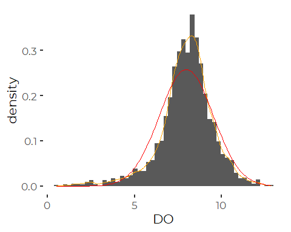
So, clearly a negatively skewed, fat tailed distribution, with low
values that turn up more frequently than expected under a normal
distribution.

``` r
m <- mean(presumpscot_data$PctSat, na.rm = TRUE)
s <- sd(presumpscot_data$PctSat, na.rm = TRUE)
plt <- ggplot(presumpscot_data, aes(PctSat)) +
  geom_histogram(aes(y = ..density..), bins=50) +
  geom_density(color = 'orange') +
  geom_function(fun = dnorm, args = list(mean = m, sd = s), color = 'red')
plt
#> Warning: Removed 101 rows containing non-finite values (stat_bin).
#> Warning: Removed 101 rows containing non-finite values (stat_density).
```

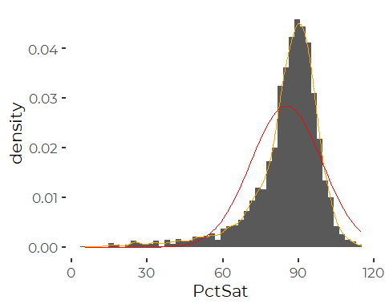
Percent Saturation is even more heavily skewed. Although this is not a
true percentage, it is effectively a ratio of random variables, and so
might be expected to be distributed closer to Cauchy.

## Percent Saturation vs. DO

``` r
plt <- ggplot(presumpscot_data, aes(DO, PctSat)) + 
  geom_point(aes(color =factor(Year))) + 
  geom_smooth() +
  geom_hline(yintercept=75, color='red') +
  geom_hline(yintercept=60, color='orange') +
  
    geom_vline(xintercept=5, color='red') +
  geom_vline(xintercept=6.5, color='orange') +
  geom_vline(xintercept=7, color='yellow') +
  theme_minimal()
plt
#> `geom_smooth()` using method = 'gam' and formula 'y ~ s(x, bs = "cs")'
#> Warning: Removed 213 rows containing non-finite values (stat_smooth).
#> Warning: Removed 213 rows containing missing values (geom_point).
```

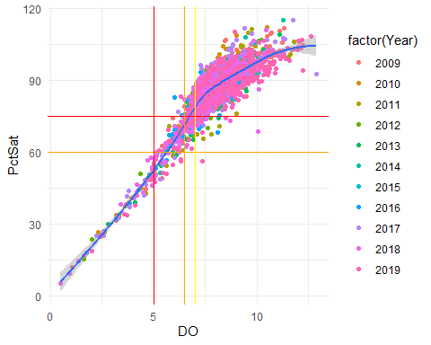

The relationship between DO and percent saturation is about as one would
expect, with a largely linear relationship for low concentrations of DO,
but a curvilinear relationship as DO levels exceed about 80%.

# Linear Models

All analyses here are a bit cavalier, as we end up concluding that we
will not use specific results of these analyses directly in SoCB. We do
not, for example, look at all relevant model diagnostics, and do not
search for alternative models that may provide better estimates of
standard errors and nominal p values. That may be important because we
know both DO and Percent Saturation figures are likely to be somewhat
skewed, with significant kurtosis. The justification is that we cannot
look at results across all monitoring sites, and probably should look at
each monitoring site individually, but we do not have the space in SoCB
to do so effectively. The only summaries we use therefore are site by
site means and frequencies.

## Dissolved Oxygen

``` r
do_lm <- lm(DO ~ Site + Month + YearF + Site:YearF, data = presumpscot_data)
do_lm_2 <- lm(DO ~ Site + Month + Year + Site:Year, data = presumpscot_data)
fin_mod <- step(do_lm)
#> Start:  AIC=-406.05
#> DO ~ Site + Month + YearF + Site:YearF
#> 
#>               Df Sum of Sq    RSS     AIC
#> <none>                     1332.4 -406.05
#> - Site:YearF 240    648.96 1981.4  -38.50
#> - Month        4    824.36 2156.8  614.68
fin_mod_2 <- step(do_lm_2)
#> Start:  AIC=223.02
#> DO ~ Site + Month + Year + Site:Year
#> 
#>             Df Sum of Sq    RSS     AIC
#> <none>                   2171.3  223.02
#> - Site:Year 42    120.53 2291.8  254.42
#> - Month      4   1008.06 3179.4 1029.59
```

``` r
anova(fin_mod)
#> Analysis of Variance Table
#> 
#> Response: DO
#>              Df  Sum Sq Mean Sq  F value    Pr(>F)    
#> Site         46 1764.05  38.349  52.8136 < 2.2e-16 ***
#> Month         4 1003.86 250.966 345.6276 < 2.2e-16 ***
#> YearF        10  342.26  34.226  47.1351 < 2.2e-16 ***
#> Site:YearF  240  648.96   2.704   3.7239 < 2.2e-16 ***
#> Residuals  1835 1332.42   0.726                       
#> ---
#> Signif. codes:  0 '***' 0.001 '**' 0.01 '*' 0.05 '.' 0.1 ' ' 1
anova(fin_mod_2)
#> Analysis of Variance Table
#> 
#> Response: DO
#>             Df  Sum Sq Mean Sq  F value    Pr(>F)    
#> Site        46 1764.05  38.349  36.0650 < 2.2e-16 ***
#> Month        4 1003.86 250.966 236.0196 < 2.2e-16 ***
#> Year         1   31.79  31.791  29.8979 5.112e-08 ***
#> Site:Year   42  120.53   2.870   2.6989 3.378e-08 ***
#> Residuals 2042 2171.31   1.063                       
#> ---
#> Signif. codes:  0 '***' 0.001 '**' 0.01 '*' 0.05 '.' 0.1 ' ' 1
```

So, in both cases, the best model (by AIC) includes both year and year
by site interaction terms, and fitting a separate value for each year
provides a stronger fit than fitting a linear term.

That means we have no real pattern to point to across sites. We need to
evaluate each site more or less independently. There is little evidence
for a meaningful trend across the region.

To evaluate the temporal pattern, we can fit a model by year that treats
each site as a random factor, and focuses on average conditions year by
year across sites. We include the Month term in the model to reduce
variance estimates.

``` r
thlmer <- lmer(DO ~ YearF + Month + ( 1 | Site), data = presumpscot_data)
anova(thlmer)
#> Analysis of Variance Table
#>       npar Sum Sq Mean Sq F value
#> YearF   10 472.21  47.221  49.449
#> Month    4 873.47 218.368 228.671
```

``` r
summary(thlmer)
#> Linear mixed model fit by REML ['lmerMod']
#> Formula: DO ~ YearF + Month + (1 | Site)
#>    Data: presumpscot_data
#> 
#> REML criterion at convergence: 6165.3
#> 
#> Scaled residuals: 
#>     Min      1Q  Median      3Q     Max 
#> -3.7880 -0.5619 -0.0242  0.5558  5.8414 
#> 
#> Random effects:
#>  Groups   Name        Variance Std.Dev.
#>  Site     (Intercept) 0.9452   0.9722  
#>  Residual             0.9549   0.9772  
#> Number of obs: 2136, groups:  Site, 47
#> 
#> Fixed effects:
#>             Estimate Std. Error t value
#> (Intercept)  9.50611    0.16918  56.188
#> YearF2010   -0.09151    0.12009  -0.762
#> YearF2011   -1.04741    0.10841  -9.662
#> YearF2012   -0.40807    0.11574  -3.526
#> YearF2013   -0.16011    0.10988  -1.457
#> YearF2014    0.42209    0.10708   3.942
#> YearF2015   -0.29342    0.11433  -2.566
#> YearF2016   -0.56094    0.13046  -4.300
#> YearF2017   -0.02344    0.10144  -0.231
#> YearF2018   -0.41905    0.09856  -4.252
#> YearF2019    0.40906    0.09789   4.179
#> MonthJun    -1.00181    0.07610 -13.165
#> MonthJul    -1.91583    0.07598 -25.214
#> MonthAug    -2.01837    0.07771 -25.973
#> MonthSep    -1.63538    0.09825 -16.645
#> 
#> Correlation matrix not shown by default, as p = 15 > 12.
#> Use print(x, correlation=TRUE)  or
#>     vcov(x)        if you need it
```

``` r
plot(emmeans(thlmer, 'Month'))
```

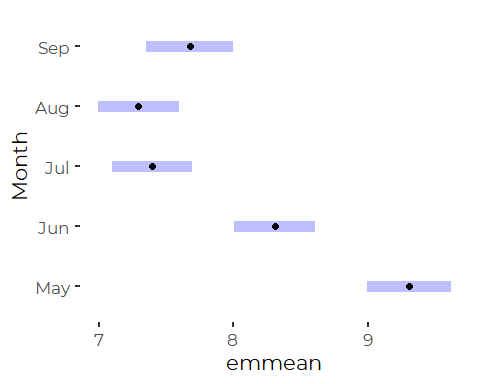

Note that dissolved oxygen follows the pattern one might expect based on
seasonal temperatures, with the highest DO occurring early in the year,
and lowest occurring in summer.

``` r
plot(emmeans(thlmer, 'YearF'))
```

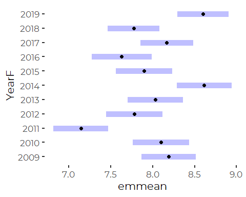

As for the *E. coli* data, there is no robust long term trend here.
Although a “significant” trend can be detected statistically via a
linear model, its slope is low, and the analysis tends to hide site to
site and year to year variation.

## Percent Saturation

``` r
pctsat_lm <- lm(PctSat ~ Site + Month + YearF + Site:YearF, data = presumpscot_data)
pctsat_lm_2 <- lm(PctSat ~ Site + Month + Year + Site:Year, data = presumpscot_data)
fin_mod <- step(pctsat_lm)
#> Start:  AIC=8867.59
#> PctSat ~ Site + Month + YearF + Site:YearF
#> 
#>               Df Sum of Sq    RSS    AIC
#> <none>                     101821 8867.6
#> - Month        4     13453 115274 9126.0
#> - Site:YearF 230     53247 155068 9310.7
fin_mod_2 <- step(pctsat_lm_2)
#> Start:  AIC=9375.7
#> PctSat ~ Site + Month + Year + Site:Year
#> 
#>             Df Sum of Sq    RSS    AIC
#> <none>                   154994 9375.7
#> - Site:Year 42     11472 166466 9445.0
#> - Month      4     16380 171375 9583.4
```

``` r
anova(fin_mod)
#> Analysis of Variance Table
#> 
#> Response: PctSat
#>              Df Sum Sq Mean Sq F value    Pr(>F)    
#> Site         46 239037  5196.5  94.722 < 2.2e-16 ***
#> Month         4  16579  4144.7  75.550 < 2.2e-16 ***
#> YearF        10  11443  1144.3  20.859 < 2.2e-16 ***
#> Site:YearF  230  53247   231.5   4.220 < 2.2e-16 ***
#> Residuals  1856 101821    54.9                      
#> ---
#> Signif. codes:  0 '***' 0.001 '**' 0.01 '*' 0.05 '.' 0.1 ' ' 1
anova(fin_mod_2)
#> Analysis of Variance Table
#> 
#> Response: PctSat
#>             Df Sum Sq Mean Sq F value    Pr(>F)    
#> Site        46 239037  5196.5 68.8305 < 2.2e-16 ***
#> Month        4  16579  4144.7 54.8996 < 2.2e-16 ***
#> Year         1     45    45.0  0.5957    0.4403    
#> Site:Year   42  11472   273.1  3.6179 9.843e-14 ***
#> Residuals 2053 154994    75.5                      
#> ---
#> Signif. codes:  0 '***' 0.001 '**' 0.01 '*' 0.05 '.' 0.1 ' ' 1
```

So, in both cases, the best model (by AIC) again includes both year and
year by site interaction terms, and fitting a separate value for each
year provides a stronger fit than fitting a linear term (where the term
does not achieve significance).

That means we have no real pattern to point to across sites. We need to
evaluate each site independently. There is no evidence for a meaningful
trend across the region.

To evaluate the temporal pattern, we can fit a model by year that treats
each site as a random factor, and focuses on average conditions year by
year across sites. We include the Month term in the model to reduce
variance estimates.

``` r
thlmer <- lmer(PctSat ~ YearF + Month + ( 1 | Site), data = presumpscot_data)
```

``` r
summary(thlmer)
#> Linear mixed model fit by REML ['lmerMod']
#> Formula: PctSat ~ YearF + Month + (1 | Site)
#>    Data: presumpscot_data
#> 
#> REML criterion at convergence: 15504.2
#> 
#> Scaled residuals: 
#>     Min      1Q  Median      3Q     Max 
#> -5.0664 -0.4699  0.0141  0.4754  5.9277 
#> 
#> Random effects:
#>  Groups   Name        Variance Std.Dev.
#>  Site     (Intercept) 125.34   11.195  
#>  Residual              74.33    8.622  
#> Number of obs: 2147, groups:  Site, 47
#> 
#> Fixed effects:
#>              Estimate Std. Error t value
#> (Intercept) 89.590627   1.823584  49.129
#> YearF2010    0.169548   1.071933   0.158
#> YearF2011   -4.231599   1.178596  -3.590
#> YearF2012   -1.076813   0.999933  -1.077
#> YearF2013    0.167597   0.974007   0.172
#> YearF2014    4.696078   0.948990   4.949
#> YearF2015   -0.008267   0.996904  -0.008
#> YearF2016   -4.527145   1.141439  -3.966
#> YearF2017   -0.646810   0.864107  -0.749
#> YearF2018   -2.585929   0.867793  -2.980
#> YearF2019    2.258994   0.858742   2.631
#> MonthJun    -2.424535   0.651718  -3.720
#> MonthJul    -5.873673   0.654614  -8.973
#> MonthAug    -7.580985   0.671911 -11.283
#> MonthSep    -7.541640   0.834963  -9.032
#> 
#> Correlation matrix not shown by default, as p = 15 > 12.
#> Use print(x, correlation=TRUE)  or
#>     vcov(x)        if you need it
```

``` r
plot(emmeans(thlmer, 'Month'))
```

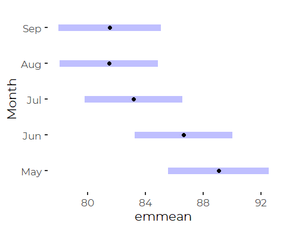

Percent Saturation also shows a seasonal (Monthly) signal, which is
somewhat harder to explain than variation in dissolved oxygen alone,
although the variation in mean percent saturation is relatively small –
ranging only from about 80% to about 90%. If seasonal patterns were the
focus of our analysis, we would need to fit additional models with site
by month interaction terms, and probably treat Year as the random factor
here, not sites.

``` r
plot(emmeans(thlmer, 'YearF'))
```

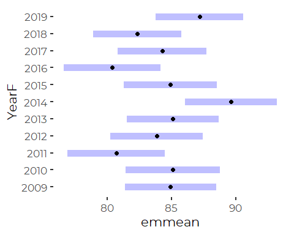

## Models Including Temperature

The fact that Percent Saturation models show reduced signal compared to
DO models suggests that year to year variation in temperature may be
important.

### Graph Annual Average Temperatures

``` r
presumpscot_data %>%
  group_by(Year) %>%
  summarize(mean_temp = mean(Temp, na.rm = TRUE)) %>%
  ggplot(aes(Year, mean_temp)) +
  geom_line()
#> Warning: Removed 1 row(s) containing missing values (geom_path).
```

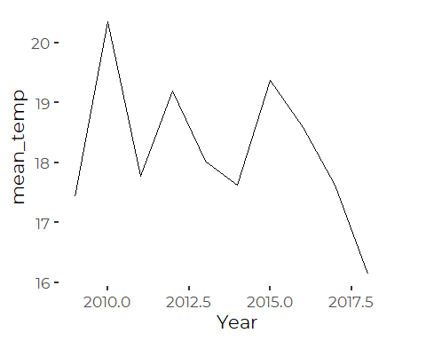
Average water temperatures are not especially closely correlated with
annual average air temperatures. (Based on an informal comparison with
NWS data from the Portland Jetport.)

### Construct a Linear Mixed Model

We fit a non-linear term for temperature, as we expect the relationship
to be non-linear. Our interest, however, focuses on the residual effects
on dissolved oxygen. Note we are NOT fitting interaction terms with site
here, even though they are likely important. The point here is just to
evaluate whether there is a strong regional trend over time that might
justify presenting simplified graphics in SoCB. We conclude there is
not.

``` r
t_lmer <- lmer(DO~ Temp + I(Temp^2) +  Month + YearF + (1 | Site),
               data = presumpscot_data)
```

``` r
summary(t_lmer)
#> Linear mixed model fit by REML ['lmerMod']
#> Formula: DO ~ Temp + I(Temp^2) + Month + YearF + (1 | Site)
#>    Data: presumpscot_data
#> 
#> REML criterion at convergence: 3593.2
#> 
#> Scaled residuals: 
#>     Min      1Q  Median      3Q     Max 
#> -4.5396 -0.4845 -0.0044  0.4478  6.9569 
#> 
#> Random effects:
#>  Groups   Name        Variance Std.Dev.
#>  Site     (Intercept) 1.542    1.2416  
#>  Residual             0.702    0.8378  
#> Number of obs: 1364, groups:  Site, 40
#> 
#> Fixed effects:
#>              Estimate Std. Error t value
#> (Intercept) 13.932506   0.599324  23.247
#> Temp        -0.408470   0.063548  -6.428
#> I(Temp^2)    0.005135   0.001661   3.091
#> MonthJun    -0.033425   0.090144  -0.371
#> MonthJul    -0.142356   0.108086  -1.317
#> MonthAug    -0.286576   0.107813  -2.658
#> MonthSep    -0.719913   0.146601  -4.911
#> YearF2010   -0.013218   0.106452  -0.124
#> YearF2011   -0.520378   0.117050  -4.446
#> YearF2012   -0.059485   0.103912  -0.572
#> YearF2013    0.000451   0.096875   0.005
#> YearF2014    0.489290   0.093602   5.227
#> YearF2015    0.022777   0.102041   0.223
#> YearF2016   -0.458257   0.115102  -3.981
#> YearF2017   -0.081632   0.092685  -0.881
#> YearF2018   -0.140606   0.357995  -0.393
#> 
#> Correlation matrix not shown by default, as p = 16 > 12.
#> Use print(x, correlation=TRUE)  or
#>     vcov(x)        if you need it
```

After accounting for temperature, we still see a couple of anomalous
years, specifically 2011, 2014, and 2016.  
\* 2016 was a year with low summer flows after a wet spring.  
\* 2014 shows no precipitation at all in summer months (At least
according to Portland Jetport weather data.) This is so unlikely, that
we wonder if it is a data error of some kind, although apparently not
flagged as such). It was also an unusually hot summer, with monthly mean
temperatures a couple of degrees C higher than usual. \* 2011 was a
fairly normal rainfall year.

But that is all data cherry picking, so should not be taken too
seriously without more rigorous evaluation.

``` r
plot(emmeans(t_lmer, 'Month'))
```

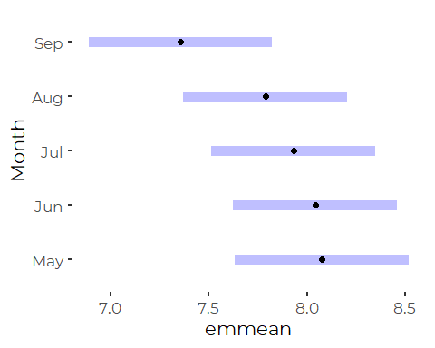
After accounting for temperature variation, there is very little
variation in dissolved oxygen by month, although DO corrected from
temperature does appear to drop at the end of the season.

``` r
plot(emmeans(t_lmer, 'YearF'))
```

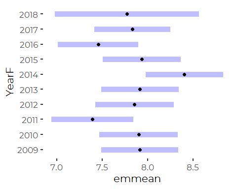

And there is no meaningful trend over time.

# Export Tabular Data for GIS

We want to create a table of results to import into GIS. We have
interest in both mean dissolved oxygen levels and frequency of
exceedances of DO criteria.

We focus on the last five years of the record, and do not want to
segregate by year, so we recalculate site by site frequencies and
averages here.

``` r
do_ins <- presumpscot_data %>%
  filter(! is.na(DO)) %>%
  filter(Site %in% recentsites) %>%
  filter (Year > 2014) %>%
  
  group_by(Site) %>%
  summarise(DO_Sample = sum(! is.na(DO)),
            DO_AB = sum(DO >= 7, na.rm = TRUE),
            DO_C = sum(DO<7 & DO>=5),
            DO_NA = sum(DO < 5 ),
            DO_Avg = mean(DO, na.rm = TRUE),
            DO_SD = sd(DO, na.rm = TRUE),            
            .groups = 'drop')
```

``` r
ps_ins <- presumpscot_data %>%
  filter(! is.na(PctSat)) %>%
  filter(Site %in% recentsites) %>%
  filter(Year > 2014) %>%
  group_by(Site) %>%
  summarise(PS_Sample = sum(! is.na(PctSat)),
            PS_AB = sum(PctSat>=75, na.rm=TRUE),
            PS_C = sum(PctSat<75 & PctSat>=60, na.rm=TRUE),
            PS_NA = sum(PctSat<60, na.rm=TRUE),
            PS_Avg = mean(PctSat, na.rm = TRUE),
            PS_SD = sd(PctSat, na.rm = TRUE),
            .groups = 'drop')
```

``` r
do_results <- do_ins %>%
  full_join(ps_ins, by = 'Site')
```

## Add Code To calculate Class

To Calculate the Observed Class, we need to look at the probability of
violating water quality thresholds.

Technically, any violation of standards for dissolved oxygen controls
whether a violation of water quality standards has occurred. But on some
level, with a long record, we may want to be more forgiving and allow a
rare problem. In the following, we accept zero or one exceedences of a
standard before we declare the site to have failed that standard.

Rather than expressing our results in ‘Class AB’, ‘Class C’, ‘Non
Attainment’ terms, which are unlikely to be widely understood by the
SoCB audience, we express results in terms of ‘Excellent’, ‘Good’, and
‘Poor’, water quality. The thresholds, however, partially reflect Maine
water quality standards.

``` r
do_results <- do_results %>%
mutate(DO_Meets = if_else(DO_NA < 2,
                          if_else(DO_C < 2,
                                  'Excellent',
                                  'Good'),
                          'Poor'),
       PS_Meets = if_else(PS_NA < 2,
                          if_else(PS_C < 2,
                                  'Excellent',
                                  'Good'),
                          'Poor'
                           ),
       Both_Meets =  if_else(DO_NA < 2 & PS_NA < 2,
                          if_else(DO_C < 2 & PS_C < 2,
                                  'Excellent',
                                  'Good'),
                          'Poor')) %>%
  
  # The following has no effect on the achieved classification in our data.
  # We include it here for completeness.
  mutate(All_Meets = if_else(DO_Avg < 6.5, 'Poor', Both_Meets))
```

``` r
write_csv(do_results, 'DO_Results.csv')
```

# Complex Site by Time Graphics

These graphics are too complex for use in SoCB, but they are
nevertheless of interest.

## Instantaneous DO Standards (7, 5 mg/l)

``` r
do_ins <- presumpscot_data %>%
  group_by(Site, Year) %>%
  filter(! is.na(DO)) %>%
  filter(Site %in% recentsites) %>%
  summarise(Sample = sum(! is.na(DO)),
            AB = sum(DO >= 7, na.rm = TRUE),
            C = sum(DO<7 & DO>=5),
            `NA` = sum(DO < 5 ),
            DO_Avg = mean(DO, na.rm = TRUE),
            DO_SD = sd(DO, na.rm = TRUE),            
            .groups = 'drop')
```

``` r
plt <- do_ins %>%
  select(-Sample, -DO_Avg, -DO_SD) %>%
  pivot_longer(-c(Site, Year, ),
               names_to = 'Category',
               values_to = 'Count') %>%
  
  ggplot(aes(Year, Count, fill = Category)) +
  geom_area(position = position_stack()) +   # alternative is position_fill()
  facet_wrap(~ Site)  +
  labs(title =("Instantaneous DO Standards"),
       x = "Year",
       y = " Observations Meeting Class") +
  scale_fill_manual(values = cbep_colors2()[4:2], name = '') + 
  
  theme_cbep() +
  theme(axis.text.x = element_text(angle=90)) +
  
  scale_x_continuous(labels=scales::number_format(accuracy = 1),
                     breaks = c(2009, 2011, 2013, 2015, 2017, 2019))
plt
```

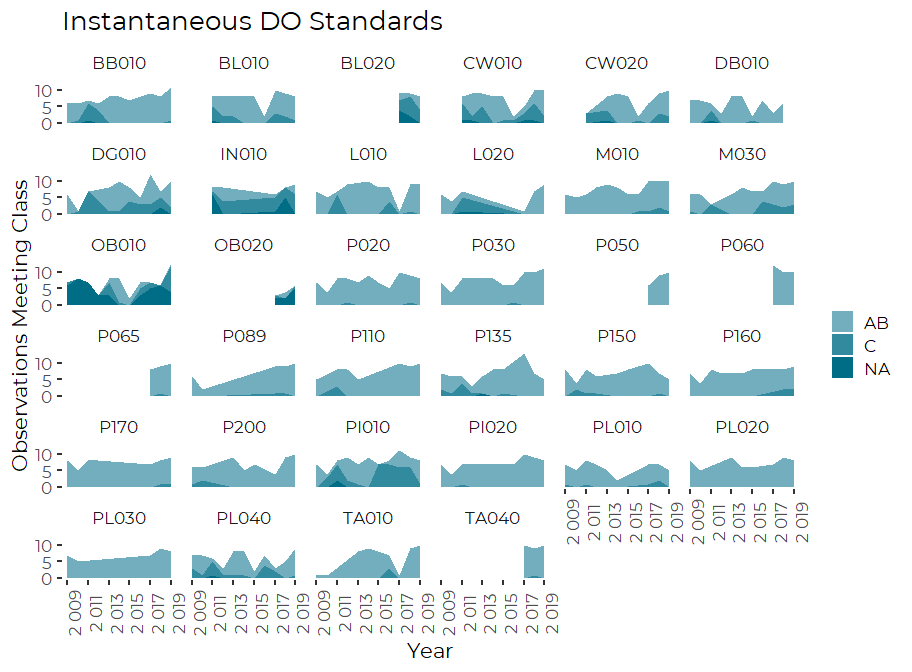
So, the bottom line is, failure of low DO standards for class B are
rare, and occur at only a couple of locations. For some sites, the
displays are misleading, because they fail to connect non-adjacent
years, thus omitting information.

## Instantaneous Saturation Standards (75%, 60%)

``` r
ps_ins <- presumpscot_data %>%
  filter(! is.na(PctSat)) %>%
  filter(Site %in% recentsites) %>%
  group_by(Site, Year) %>%
  summarise(Sample = sum(! is.na(PctSat)),
            Excellent = sum(PctSat>=75, na.rm=TRUE),
            Good = sum(PctSat<75 & PctSat>=60, na.rm=TRUE),
            Poor = sum(PctSat<60, na.rm=TRUE),
            PctSat_Avg = mean(PctSat, na.rm = TRUE),
            PctSat_SD = sd(PctSat, na.rm = TRUE),
            .groups = 'drop')
```

``` r
plt <- ps_ins %>%
  select(-Sample, -PctSat_Avg, -PctSat_SD) %>%
  pivot_longer(-c(Site, Year, ),
               names_to = 'Category',
               values_to = 'Count') %>%

  ggplot(aes(Year, Count, fill=Category)) +
  geom_area(position = position_stack()) +
  facet_wrap(~Site)  +
  #scale_x_continuous(breaks=c(2017, 2018, 2019)) +
  #scale_y_continuous(breaks=c(1:6*2))

  labs(title =("Instantaneous Percent Saturation Standards"),
       x = "Year",
       y = " Observations Meeting Class") +
  scale_fill_manual(values = cbep_colors2()[4:2], name = '') + 
  
  theme_cbep() +
  theme(axis.text.x = element_text(angle=90)) +
  
  scale_x_continuous(labels=scales::number_format(accuracy = 1),
                     breaks = c(2009, 2011, 2013, 2015, 2017, 2019))
plt
```

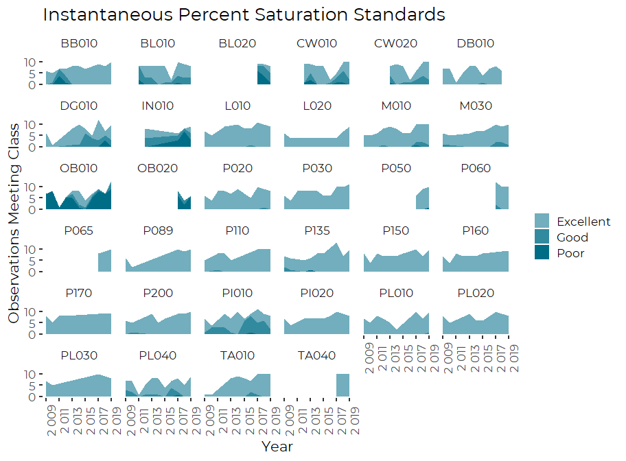

So, failure of the Pct Saturation standards happened only a few times
also, and only at a handful of sites.
