Analysis of Bacteria Data from Presumpscot Monitoring
================
Curtis C. Bohlen, Casco Bay Estuary Partnership
12/30/2020

  - [Introduction](#introduction)
      - [Maine’s Numeric Water Quality
        Standards](#maines-numeric-water-quality-standards)
  - [Import Libraries](#import-libraries)
  - [Import Data](#import-data)
      - [Folders](#folders)
      - [Data](#data)
  - [Lists of Sites for Specific
    Analyses](#lists-of-sites-for-specific-analyses)
      - [Sites for Trend Analysis](#sites-for-trend-analysis)
      - [Recent Sites](#recent-sites)
  - [*E. coli* Histograms](#e.-coli-histograms)
  - [What Distribution Fits?](#what-distribution-fits)
  - [Compare Possible Distributions](#compare-possible-distributions)
      - [Direct Fits Using VGLM](#direct-fits-using-vglm)
          - [Comparing Two Different Lognormal
            Fits](#comparing-two-different-lognormal-fits)
          - [Prepare Gamma Fit for
            Graphing](#prepare-gamma-fit-for-graphing)
      - [Plot Candidate Distributions](#plot-candidate-distributions)
      - [QQPlots](#qqplots)
      - [Compare Log Likelihoods](#compare-log-likelihoods)
  - [Linear Models Based on Recent
    Data](#linear-models-based-on-recent-data)
      - [Examine The Mixed Model](#examine-the-mixed-model)
  - [Violations of Instantaneous *E. coli*
    Standards](#violations-of-instantaneous-e.-coli-standards)
      - [Binomial Model](#binomial-model)
      - [Graphic by Site and Year](#graphic-by-site-and-year)
  - [Assemble and Export Data for
    GIS](#assemble-and-export-data-for-gis)
  - [Plot Geometric Means by Site](#plot-geometric-means-by-site)


# Introduction

This notebook provides a look at data derived from eleven years of a
volunteer water quality monitoring managed by Presumpscot River Watch
(PRW), and more recently, by the Presumpscot Land Trust (PRLT). The data
were delivered to CBEP by staff at PRLT in March of 2020, incorporating
data through 2019. PRW began submitting data to DEP in 2009, so the data
reviewed here only goes back that far.

The goal of this analysis was to create graphics for the 2020 State of
the Bay Report. A secondary purpose is to compare observed conditions to
Maine’s water quality standards, and look for any temporal patterns that
could inform consideration of reclassification of lower stretches of the
river.

## Maine’s Numeric Water Quality Standards

Maine’s numerical water quality standards for the summer months, as laid
out in statute (38 MRSA 465) are as follows:

| Class | DO ppm “Instantaneous” | DO ppm 30 Day Avg | Percent Saturation | *E. coli* (\# per 100 ml) Instantaneous | *E. coli* (\# per 100 ml)Geom. Mean |
| ----- | ---------------------- | ----------------- | ------------------ | --------------------------------------- | ----------------------------------- |
| A     | 7                      |                   | 75 %               |                                         |                                     |
| B     | 7                      |                   | 75 %               | 236                                     | 64                                  |
| C     | 5                      | 6.5               | 60 %               | 236                                     | 126                                 |

(Class “AA” streams are not shown in this table because there are no
numerical standards unique to AA streams.) Bacteria standards apply over
a 90 day period, with the instantaneous standard not to be exceeded more
than 10% of the time over a 90 day period.

# Import Libraries

``` r
library(fitdistrplus)
#> Loading required package: MASS
#> Loading required package: survival
library(VGAM)       # This is a huge package, here, offering many distributions
#> Loading required package: stats4
#> Loading required package: splines
library(tidyverse)
#> -- Attaching packages --------------------------------------- tidyverse 1.3.0 --
#> v ggplot2 3.3.2     v purrr   0.3.4
#> v tibble  3.0.4     v dplyr   1.0.2
#> v tidyr   1.1.2     v stringr 1.4.0
#> v readr   1.4.0     v forcats 0.5.0
#> -- Conflicts ------------------------------------------ tidyverse_conflicts() --
#> x tidyr::fill()   masks VGAM::fill()
#> x dplyr::filter() masks stats::filter()
#> x dplyr::lag()    masks stats::lag()
#> x dplyr::select() masks MASS::select()

library(lme4)
#> Loading required package: Matrix
#> 
#> Attaching package: 'Matrix'
#> The following objects are masked from 'package:tidyr':
#> 
#>     expand, pack, unpack
library(emmeans)

library(CBEPgraphics)
load_cbep_fonts()
theme_set(theme_cbep())
```

# Import Data

## Folders

Note this code focuses on the *E. coli* data, and drops dissolved oxygen
data.

``` r
sibfldnm <- 'Derived_Data'
parent <- dirname(getwd())
sibling <- paste(parent,sibfldnm, sep = '/')

dir.create(file.path(getwd(), 'figures'), showWarnings = FALSE)
```

## Data

``` r
fn <- 'presumpscot_CORRECTED.csv'


presumpscot_data <- read_csv(file.path(sibling, fn),
    col_types = cols(Ecoli = col_double(),
                     X1 = col_skip()))
#> Warning: Missing column names filled in: 'X1' [1]

presumpscot_data <- presumpscot_data %>%
  select (-Time, -DO, -PctSat) %>%
  filter( ! is.na(Ecoli)) %>%
  mutate(Month = factor(as.numeric(format(Date, '%m')),
                        labels = month.abb[5:9])) %>%  # Note that as.numeric()
                                                       # will not give month 1;12
  mutate(YearF = factor(Year))
```

# Lists of Sites for Specific Analyses

A total of 47 locations have been sampled by PRW and PRLT since 2009.
The normal sampling plan in each year is to sample a fixed number of
Saturdays. That number is usually eight. We often see more than eight
sample records at a site within a year. Generally this is because QA/QC
replicate samples were collected, or DO data were collected at different
depths on one sample date. Multiple depth samples were only collected in
2011, 2012, and 2013.

There are SOMETIMES substantial differences in observed *E. coli* values
for replicate samples, expressed as a percent difference. On a log
scale, however, the differences are less apparent.

Prior analysis has shown that \* E. coli\* samples were not replicated
at multiple depths. Only dissolved oxygen data was collected at at
depth, so we need only look at surface samples here.

## Sites for Trend Analysis

Here we create a vector of sites sampled at least five times. Note that
this omits some recent sites, but provides the sites for which trend
analysis may be useful.

``` r
trendsites <- presumpscot_data %>%
  group_by(Site, Year) %>%
  summarize(sampled = n()>0,
            .groups = 'drop_last') %>%
  summarise(yrssampled = sum(sampled)) %>%
  filter(yrssampled>=5) %>%
  pull(Site)
#> `summarise()` ungrouping output (override with `.groups` argument)
trendsites
#>  [1] "BB010" "BL010" "CW010" "CW020" "DB010" "DG010" "IN010" "L010"  "L020" 
#> [10] "M010"  "M030"  "N010"  "OB010" "P020"  "P030"  "P089"  "P110"  "P135" 
#> [19] "P150"  "P160"  "P170"  "P200"  "PI010" "PI020" "PL010" "PL020" "PL030"
#> [28] "PL040" "TA010"
```

Twenty nine sites have been sampled at least five times, and thus could
be used to estimate / study trends.

## Recent Sites

We look at data collected over the past five years, restricted to sites
with at least two years of data. No site with at least three years of
data has fewer than 15 samples. This cuts out some sites that have only
recently been added to the monitoring program, and some that have not
been monitored recently.

``` r
recentsites <- presumpscot_data %>%
  filter(Year>2014) %>%
  group_by(Site, Year) %>%
  summarize(sampled = n()>0,
            samples = n(),
            .groups = 'drop_last') %>%
  summarise(yrssampled = sum(sampled),
            samples=sum(samples),
            .groups = 'drop') %>%
  filter(yrssampled > 2) %>%
  arrange(samples)
recentsites
#> # A tibble: 34 x 3
#>    Site  yrssampled samples
#>    <chr>      <int>   <int>
#>  1 OB020          3      18
#>  2 L020           3      19
#>  3 P160           3      25
#>  4 BL020          3      26
#>  5 IN010          3      26
#>  6 PL030          3      26
#>  7 P050           3      27
#>  8 P065           3      28
#>  9 P089           3      28
#> 10 P170           3      29
#> # ... with 24 more rows
```

``` r
recentsites <- recentsites %>% pull(Site)
```

# *E. coli* Histograms

``` r
plt <- ggplot(presumpscot_data, aes(Ecoli)) +
  geom_histogram(aes(fill = Flag), bins=50) #+
  #geom_density()
plt
```

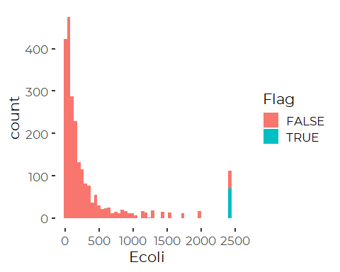
Notice that the values, while conceptually continuous are converted to
select discrete values by the MPN method used . Technically this is
interval censored data, but there are so many categories that the impact
on analysis is probably small.

The number of “uncensored” large values looks implausibly high, and a
close look shows that several slightly different values are all included
with NEARLY identical values. I suspect that reflects different coding
practices over time.

``` r
plt  + scale_x_log10()
```

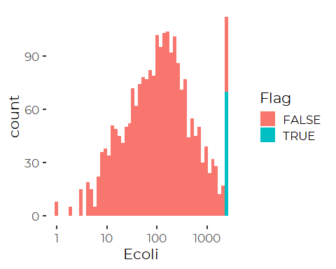
We have a fat tailed mound-like distribution, which suggests a lognormal
distribution may work well for these data. But note also that we have an
excess of elevated values. Why? Note that this level of extreme values
suggests the geometric means are going to underestimate the real values.

# What Distribution Fits?

``` r
presumpscot_data %>%
  filter(! is.na(Ecoli)) %>%
  pull(Ecoli) %>%
  descdist(boot = 1000)
```

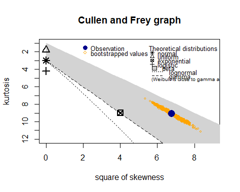

    #> summary statistics
    #> ------
    #> min:  1   max:  2419.6 
    #> median:  118.85 
    #> mean:  343.8059 
    #> estimated sd:  577.3502 
    #> estimated skewness:  2.601507 
    #> estimated kurtosis:  9.079032

That suggests the lognormal distribution would NOT do very well, because
the data is more skewed than expected. However, we know there is a lot
of variation by sites, so the skewness may reflect site by site
variation.

# Compare Possible Distributions

## Direct Fits Using VGLM

We fit distributions to the *E. coli* data, without regard for the
structure of the predictors – here principally the Year and the Site –
as a way to better understand whether and how to manage what is likely
to be some sort of extreme value distribution.

We fit a lognormal, Gamma, Pareto, and exponential distributions using
tools from the `VGAM` package, and also a simple linear model on log
transformed data.

``` r
fit.LN <- vglm( Ecoli~ 1, family=lognormal, data = presumpscot_data)
fit.Gamma <- vglm( Ecoli~ 1, family=gamma2, data = presumpscot_data)
fit.Pareto <- vglm( Ecoli~ 1, family=paretoII, data = presumpscot_data)
fit.Exp <- vglm( Ecoli~ 1, family=exponential, data = presumpscot_data)
fit.LN <- vglm( Ecoli~ 1, family=lognormal, data = presumpscot_data)
fit.LN.2 <- lm(log(Ecoli)~ 1, data = presumpscot_data)
```

### Comparing Two Different Lognormal Fits

The `VGAM` lognormal distribution and the fit to log transformed data
should provide the same results. at first glance, they do not, but that
is only because of different conventions regarding how to report model
parameters.

A web textbook called [Loss Data Analytics: An open text authored by the
Actuarial Community](https://ewfrees.github.io/Loss-Data-Analytics/)
provides some helpful ideas regarding analysis of heavy tailed
distributions in R. Based on information found there, the SD of the log
data should be `exp(coef(fit.LN)[2])`

``` r
coef(fit.LN)
#> (Intercept):1 (Intercept):2 
#>     4.7289884     0.4601252

cat('\n')
unname(exp(coef(fit.LN)[2]))
#> [1] 1.584272
```

Compare to the mean and SD of a normal distribution based on the log
transformed data:

``` r
coef(fit.LN.2)
#> (Intercept) 
#>    4.728988
sigma(fit.LN.2)
#> [1] 1.584613
```

So, the location parameters match, and the scale parameter produced by
VGAM is the log of the scale parameter produced by analyzing the log of
the data.

### Prepare Gamma Fit for Graphing

To simplify graphing a gamma distribution, we will use the built-in
gamma distribution functions from Core R’s `stats` package.
Unfortunately, they use a different parameterization from the gamma
distribution in `VGAM`. WE need to convert them.

``` r
coef(fit.Gamma)
#> (Intercept):1 (Intercept):2 
#>     5.8400773    -0.5769511
```

The parameterization for the core R `pgamma()`, `rgamma()`, and
`qgamma()` functions are in terms of theta and alpha parameters.

``` r
(theta<-exp(coef(fit.Gamma)[1])/exp(coef(fit.Gamma)[2])) #theta=mu/alpha
#> (Intercept):1 
#>      612.1813
(alpha<-exp(coef(fit.Gamma)[2]))
#> (Intercept):2 
#>      0.561608
```

## Plot Candidate Distributions

here, we plot the data density, and then overlay the fitted
distributions.

``` r
plot(density(log(presumpscot_data$Ecoli[! is.na(presumpscot_data$Ecoli)])), 
     main="", 
     xlab="Log Expenditures", 
     ylim=c(0,0.4),
     lwd = 2.5)

x <- seq(0,15,by=0.01)

fexp_ex <- dgamma(exp(x), scale = exp(-coef(fit.Exp)), shape = 1)*exp(x)
lines(x,fexp_ex, col="red")

fgamma_ex <- dgamma(exp(x), shape = alpha, scale=theta)*exp(x)
lines(x,fgamma_ex,col="blue")

fpareto_ex <- dparetoII(exp(x),
                        loc=0,shape = exp(coef(fit.Pareto)[2]), 
                        scale = exp(coef(fit.Pareto)[1])) * exp(x)
lines(x,fpareto_ex,col="purple", lwd=2)

flnorm_ex <- dlnorm(exp(x), 
                    mean = coef(fit.LN)[1], 
                    sd = exp(coef(fit.LN)[2]))*exp(x)
lines(x,flnorm_ex, col="lightblue", lwd=2)
```

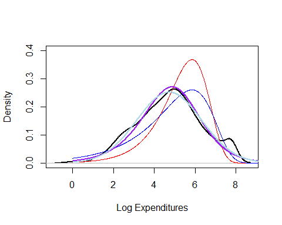
The Exponential and gamma distributions are too highly skewed, and are
clearly relatively poor fits. Both the Pareto (purple) and the lognormal
(light blue) distributions look good. The Pareto looks perhaps slightly
better.

Note the “bump” at the upper limit, which reflects censored values.

## QQPlots

Of our two best candidate distributions.

``` r
dat <- presumpscot_data$Ecoli[! is.na(presumpscot_data$Ecoli)]
p <- ppoints(sum(! is.na(presumpscot_data$Ecoli)))

oldpar = par(mfrow=c(1, 2))

# Fgamma_ex = pgamma(dat, shape = alpha, scale=theta)
# qqplot(p,Fgamma_ex, xlab="Empirical DF", ylab="Gamma DF",cex=0.4, main='Gamma')
# abline(0,1)

Flnorm_ex = plnorm(dat, meanlog = coef(fit.LN)[1], sdlog = exp(coef(fit.LN)[2]))
qqplot(p, Flnorm_ex,
       xlab="Empirical DF",
       ylab="Lognormal DF",
       cex=0.4,
       main = 'Lognormal')
abline(0,1)

Fpareto_ex = pparetoII(dat,loc=0,shape = exp(coef(fit.Pareto)[2]), scale = exp(coef(fit.Pareto)[1]))
qqplot(p,Fpareto_ex,
       xlab="Empirical DF",
       ylab="Pareto DF",
       cex=0.4,
       main='Pareto')
abline(0,1)
```

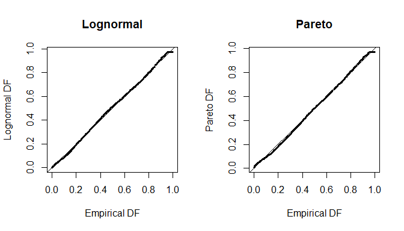

``` r

par(oldpar)
```

So, both the lognormal and the Pareto distributions work well for these
data. A still better fit might be possible with a distribution that
properly handled censored data.

## Compare Log Likelihoods

``` r
logLik(fit.Gamma)
#> [1] -15594.74
logLik(fit.Pareto)
#> [1] -15418.79
logLik(fit.LN)
#> [1] -15383.55
```

Which actually suggests the lognormal distribution is a slightly better
fit than Pareto.

\#\#Test Run: Linear Models on Log Transformed Data We proceed with
linear models on log-transformed response variables, which implicitly
fit the lognormal distribution, and have the added advantage of
providing predictions that can be readily expressed in terms of the
geometric mean, which is how the relevant standards are written.

``` r
oldpar <- par(mfrow = c(2,2))
thlm <- lm(log(Ecoli)~Site, data=presumpscot_data)
plot(thlm)
```

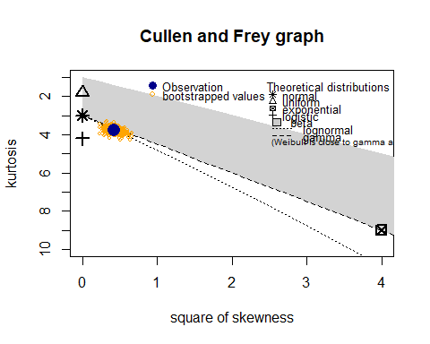

``` r
par(oldpar)
```

The only problem with this model is the obviously skewed distribution of
residuals. We check the distribution of the residuals with the
`descdist()` function from the `fitdistrplus` package.

``` r
 descdist(residuals(thlm), boot=500)
```


    #> summary statistics
    #> ------
    #> min:  -4.216659   max:  4.266651 
    #> median:  -0.1748126 
    #> mean:  7.233827e-17 
    #> estimated sd:  1.146592 
    #> estimated skewness:  0.6514815 
    #> estimated kurtosis:  3.789684

So, there is evidence that the residuals – AFTER log transforming the
data – are still moderately right skewed, and slightly heavy tailed.
Residuals AFTER log transform are approximately lognormal or Gamma.

We look at additional models.

``` r
#thlm2   <- lm(log(Ecoli) ~ Site + Month, data = presumpscot_data)
#thlm3   <- lm(log(Ecoli) ~ Site + Year,  data = presumpscot_data)
thlm4   <- lm(log(Ecoli) ~ Site + Month + Year, data = presumpscot_data)
#thlm3.5 <- lm(log(Ecoli) ~ Site + YearF,  data = presumpscot_data)
thlm4.5 <- lm(log(Ecoli) ~ Site + Month + YearF, data = presumpscot_data)
thlm5   <- lm(log(Ecoli) ~ Site + Month + Year + Site:Year, data = presumpscot_data)
thlm5.5 <- lm(log(Ecoli) ~ Site + Month + YearF + Site:YearF, data = presumpscot_data)
```

Lets look at residuals for a fairly complex model.

``` r
descdist(residuals(thlm4.5), boot=500)
```

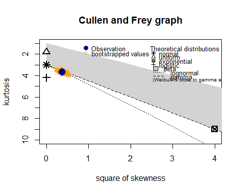

    #> summary statistics
    #> ------
    #> min:  -3.411061   max:  4.174974 
    #> median:  -0.1479068 
    #> mean:  -5.136752e-17 
    #> estimated sd:  1.060248 
    #> estimated skewness:  0.6115149 
    #> estimated kurtosis:  3.674203

The distribution of residuals is essentially unchanged. It’s again
closer to a lognormal distribution than a normal distribution. A
lognormal model, therefor, is likely to provide misleading standard
errors and confidence intervals. But since the*E. coli* standards are
written in terms of geometric means, it is still convenient to continue
with analysis of log transformed data, with appropriate cautions.

``` r
anova(thlm5)
#> Analysis of Variance Table
#> 
#> Response: log(Ecoli)
#>             Df  Sum Sq Mean Sq F value    Pr(>F)    
#> Site        46 2783.85  60.518 49.5172 < 2.2e-16 ***
#> Month        4  230.18  57.544 47.0838 < 2.2e-16 ***
#> Year         1   19.72  19.718 16.1338 6.097e-05 ***
#> Site:Year   42   79.02   1.881  1.5394   0.01496 *  
#> Residuals 2234 2730.33   1.222                      
#> ---
#> Signif. codes:  0 '***' 0.001 '**' 0.01 '*' 0.05 '.' 0.1 ' ' 1
```

``` r
AIC(thlm4, thlm5)
#>       df      AIC
#> thlm4 53 7150.108
#> thlm5 95 7167.690
```

So the interaction term is statistically significant, but is not
selected by AIC, presumably because of the large number of terms
involved, which greatly increases the risk of overfitting.

The same is true in the still larger model that fits separate values for
each year. Here, we fit a parameter for nearly every combination of two
or three observations collected in the same month. This model provides
no real explanatory value, as it can not uncover much pattern,

``` r
anova(thlm5.5)
#> Analysis of Variance Table
#> 
#> Response: log(Ecoli)
#>              Df  Sum Sq Mean Sq F value    Pr(>F)    
#> Site         46 2783.85  60.518 54.0038 < 2.2e-16 ***
#> Month         4  230.18  57.544 51.3499 < 2.2e-16 ***
#> YearF        10  213.22  21.322 19.0270 < 2.2e-16 ***
#> Site:YearF  240  344.32   1.435  1.2802  0.003819 ** 
#> Residuals  2027 2271.52   1.121                      
#> ---
#> Signif. codes:  0 '***' 0.001 '**' 0.01 '*' 0.05 '.' 0.1 ' ' 1
```

``` r
AIC(thlm4, thlm4.5, thlm5, thlm5.5)
#>          df      AIC
#> thlm4    53 7150.108
#> thlm4.5  62 7001.968
#> thlm5    95 7167.690
#> thlm5.5 302 7153.405
```

So, from a “statistical significance” perspective, both Year and Month
terms improve model performance. A non-linear fit for the year is an
improvement over a linear fit.

``` r
plot(emmeans(thlm4.5, 'YearF'))
```

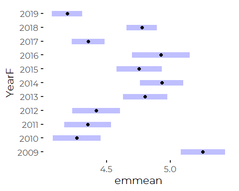
While there is year to year variation here, the patterns does not
suggest a meaningful trend, (despite a statistically significant but
small trend in `thlm4`).

For our purposes, it is worth understanding that year to year variation
is important, but we are not really that interested in it. We expect
some years to have better, and some years to have worse, water quality
based on factors like temperature, precipitation, and flow volume. Our
interest focuses on differences among sites, and more specifically, on
estimating geometric mean *E. coli* values.

Do we can model sites directly, ignoring subtleties about sampling
history, or we can use multi-level modeling to estimate marginal means
taking into account sampling history. lets compare results.

# Linear Models Based on Recent Data

We fit a simple linear model, and a model treating Years as a random
factor, to see if we gain anything by taking into account month to month
and year to year variation. We restrict attention to the most recent
five years of record and the sites for which we have sufficient recent
data to make that reasonable.

``` r
thlm <- lm(log(Ecoli) ~ Site, data=presumpscot_data,
           subset = Site %in% recentsites & Year > 2014)
thlmer <- lmer(log(Ecoli) ~ Site + Month + (1 | YearF), data=presumpscot_data,
           subset = Site %in% recentsites & Year > 2014)
```

## Examine The Mixed Model

We use the `emmeans` package to extract marginal geometric means and
confidence intervals.

``` r
lm_emm <- emmeans(thlm, 'Site', type = 'response')
lmer_emm <- emmeans(thlmer, 'Site' , type = 'response')
```

``` r
lm_fit   <- summary(lm_emm)
lmer_fit <- summary(lmer_emm)
```

``` r
tmp <- tibble(lm_emm= lm_fit$response, 
       lm_lower   = lm_fit$lower.CL,
       lm_upper   = lm_fit$upper.CL,
       lmer_emm   = lmer_fit$response,
       lmer_lower = lmer_fit$lower.CL,
       lmer_upper = lmer_fit$upper.CL)
  
  ggplot(tmp, aes(x = lm_emm, y = lmer_emm)) +


  geom_segment(aes(x = lm_emm, xend = lm_emm,
                   y = lmer_lower, yend = lmer_upper), color = 'gray') +
  geom_segment(aes(y = lmer_emm, yend = lmer_emm,
                   x = lm_lower, xend = lm_upper), color = 'gray') +
  geom_abline(intercept = 0, slope = 1) +
  geom_hline(yintercept =126, color='red') +
  geom_hline(yintercept = 64, color = 'orange') +
  geom_vline(xintercept =126, color='red') +
  geom_vline(xintercept = 64, color = 'orange') +
  geom_point() +

  
  xlab('Linear Model') +
  ylab('Mixed Model')
```


The predictions for the mixed models are, in general, slightly lower
than from the simple linear model, but the two are highly correlated we
see no real advantage to one over the other here, especially as the two
models barely diverge for the sites that meet water quality criteria.

Lets check the width of the confidence intervals to see if more
sophisticated models gained us any precision in our estimates.

``` r
tibble(lm_width   = lm_fit$upper.CL   - lm_fit$lower.CL,
              lmer_width = lmer_fit$upper.CL - lmer_fit$lower.CL) %>%
  
  ggplot(aes(x = lm_width, y = lmer_width)) +

  geom_abline(intercept = 0, slope = 1) +
  geom_point() +

  
  xlab('Linear Model CI Width') +
  ylab('Mixed Model CI Width')
```

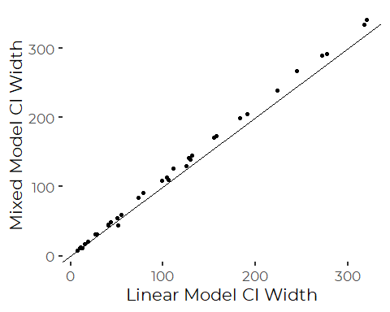

So, in fact, the mixed model shows slightly LARGER confidence intervals
than a simple linear model. This is, presumably because the year to year
variation is so large, it swamps out the advantage of accounting for
month to month variability directly.

We thus see no advantage to using the more complex models for our
purposes, which is to summarize results in a compact manner for figures
or GIS.

Rather than expressing classification results in "Class AB’, ‘Class C’,
‘Non Attainment’ terms, which are unlikely to be widely understood by
the SoCB audience, we express results in terms of ‘Excellent’, ‘Good’,
and ‘Poor’, water categories. The thresholds, however, reflect Maine
water quality standards.

# Violations of Instantaneous *E. coli* Standards

We make a table of the number of times samples have failed the
instantaneous standards.

``` r
cntfails <- presumpscot_data %>%
  filter(Year > 2014) %>%
  filter(Site %in% recentsites) %>%
  group_by(Site) %>%
  summarise(Sample    = sum(! is.na(Ecoli)),
            nFailInst = sum(Ecoli > 236, na.rm = TRUE),
            nPassInst = Sample - nFailInst,
            .groups = 'drop')
```

## Binomial Model

We can conduct a binomial analyses of those data, to evaluate
differences in probability of failing instantaneous standards. We have
little reason to be interested in whether differences among sites are
statistically significant or not, but we forge on nevertheless, to
justify presenting any results.

``` r
thglm <- glm(cbind(nFailInst, nPassInst) ~ Site, 
             family = 'binomial', data = cntfails)
```

Note that the residual degrees of freedom is zero because we fit a
parameter to each Site. That is expected, and does not prevent us from
evaluating the differences between sites.

``` r
glm_emm <- emmeans(thglm, 'Site', type = 'response')
glm_fit <- summary(glm_emm)
```

The State instantaneous water quality criteria formally apply over a 90
day period, and observations are allowed to exceed the instantaneous
standard no more than 10% of the time.

``` r
plot(glm_fit) +
  theme_cbep(base_size = 12) +
  ylab('') +
  xlab('Probability of Failing Instantaneous Standard') +
  theme(axis.title.x = element_text(size = 9)) +
  geom_vline(xintercept = 0.1) +
  annotate('text', x = 0.05, y = 35, label = '10% Threshold', angle = 90)
```

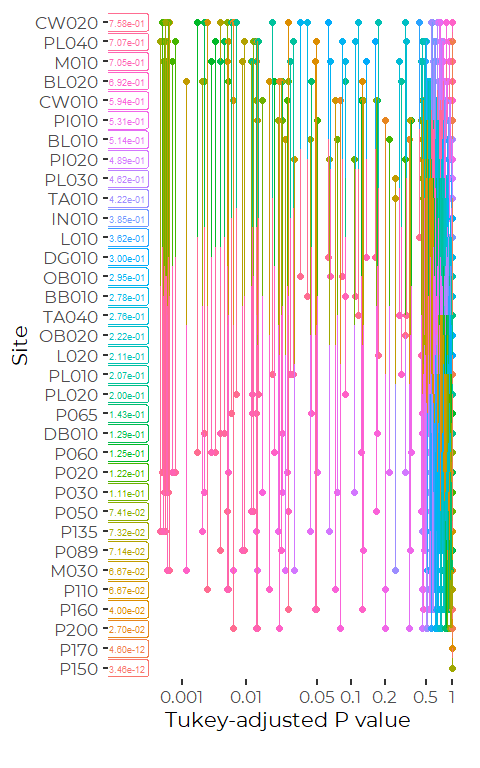

``` r
pwpp(glm_emm)
```


With so many sites, it’s nearly impossible to see what is going on,
However, On the whole, Presumpscot River Main Stem Sites (Pxxx) and most
Pleasant River sites (Plxxx) are Lower than the most polluted sites,
with a fairly large group somewhere in the middle.

## Graphic by Site and Year

First, we display graphics of all sites with at least five years of
data. We do not use this graphic in SoCB, a being too complex. Also, as
we have no evidence for long-term trends in water quality across all
sites, we can simplify the presentation in SoCB if we focus only on
sites for which we have recent data.

``` r
Ecoli_counts <- presumpscot_data %>%
  filter(Site %in% trendsites) %>%
  group_by(Site, Year) %>%
  summarise(count = sum(! is.na(Ecoli)),
            Pass  = sum(Ecoli<=236, na.rm=TRUE),
            Fail  = count-Pass,
            .groups = 'drop') %>%
  pivot_longer(c(Pass, Fail), names_to = 'WQClass', values_to = 'N_Obs') %>%
  mutate(WQClass= factor(WQClass, levels=c("Pass", "Fail")))
```

``` r
p <- ggplot(Ecoli_counts, aes(x = Year, y = N_Obs, fill= WQClass)) +
  geom_area() +
  facet_wrap(~Site) +
  
  labs(title =(expression(paste("Instantaneous ",italic("E. coli"), " Standards (< 236 CFU/100ml)"))), 
       x = "Year", 
       y = " Observations") +
  scale_fill_manual(values = cbep_colors2()[4:1], name = '') + 
  theme_minimal() +
  theme(panel.grid.major = element_blank(), panel.grid.minor = element_blank()) +
  theme(axis.text.x = element_text(angle=90)) +
  scale_x_continuous(labels=scales::number_format(accuracy = 1),
                     breaks = c(2009, 2011, 2013, 2015, 2017, 2019))
p
```

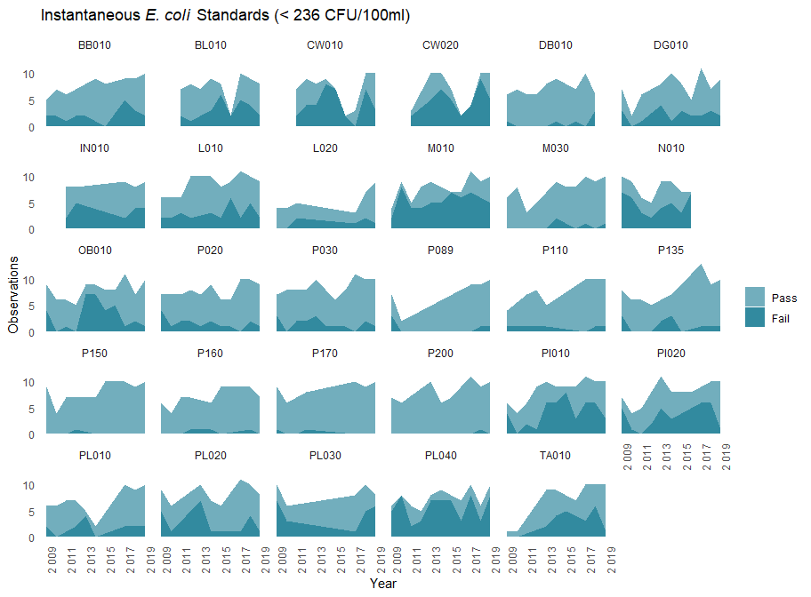

``` r

ggsave('figures/ecoli_standards by year.pdf',
       device = cairo_pdf, width = 9.5, height =7)
```

So, failure to meet instantaneous *E. coli* standards is a relatively
common occurrence, occurring at least once at each site, although
relatively rarely at most Main Stem sites on the Presumpscot.

# Assemble and Export Data for GIS

``` r
direct_values <- presumpscot_data %>%
  filter(Site %in% recentsites & Year > 2014) %>%
  group_by(Site) %>%
  summarize(Avg_Log = mean(log(Ecoli), na.rm = TRUE),
            #Geom_Mean = exp(Avg_Log),
            SD_Log  = sd(log(Ecoli), na.rm = TRUE),
            .groups = 'drop')

lm_fit2 <- lm_fit %>%
  rename(gm = response,
         gm_LC = lower.CL,
         gm_UC = upper.CL) %>%
  select(-SE, -df)
 

glm_fit2 <- glm_fit %>%
  rename(pFailIns = prob,
         pFail_LC = asymp.LCL,
         pFail_UC = asymp.UCL) %>%
  select(-SE, -df)

Ecoli_gmeans <- direct_values %>%
  left_join(lm_fit2, by = 'Site') %>%
  left_join(glm_fit2, by = 'Site') %>%

  # Calculate a simplified Class based only on geometric means
  mutate(Clss = if_else(gm <= 64,
                        'Excellent',
                        if_else(gm<= 126,
                                'Good', 'Poor'))) %>%
  # And Add in the criterion that no more than 10% or 20% of values can fail the
  # instantaneous standard. Maine 90 day standard is that no more than 10%
  # can exceed
  mutate(Clss_Inst_10 = if_else(pFailIns > 0.1,
                             'Poor', Clss),
         Clss_Inst_20 = if_else(pFailIns > 0.2,
                             'Poor', Clss))
```

``` r
write_csv(Ecoli_gmeans, 'E_coli_Results.csv')
```

# Plot Geometric Means by Site

First, for simplicity, we use the output of the `emmeans()` function.
However, the errors shown here are derived from a pooled error estimate,
and thus do not give an adequate impression of whether some sites are
highly variable or not.

``` r
ggplot(Ecoli_gmeans, aes(x = Site, y = gm)) + 
  geom_col(aes(fill = Clss)) +

  geom_linerange(aes(ymin = gm_LC, ymax = gm_UC)) +
  
  geom_hline(yintercept = 64, color = cbep_colors2()[1]) +
  geom_hline(yintercept = 126, color = cbep_colors2()[6]) +
  
  annotate('text', x = 24, y = 80,  label = 'Class B Limit', size = 2.5) +
  annotate('text', x = 24, y = 142, label = 'Class C Limit', size = 2.5) +

  theme_cbep() +
  scale_fill_manual(values = cbep_colors2()[4:1]) +
  theme(axis.text.x=element_text(angle=90, vjust = .25, size = 9)) +
  theme(legend.position = 'none') +
  
  xlab('Site') + 
  ylab('Geometric Mean E.coli\n(CFU/100ml)')
```

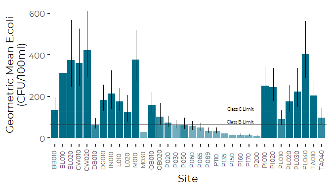

``` r

ggsave('figures/geom_means_by_site.pdf',
       device = cairo_pdf, width = 7, height = 5)
```

Notice the obvious pattern. Conditions on the Main Stem (P015 through
P200) are better than in most of the lateral tributaries, many of which
fail to meet even Class C (geometric mean) standards. Using a pooled
estimate of variance, the confidence intervals of the geometric means
are dominated by scale, not by site to site variation in variability.

Now we plot site by site means and standard deviations of log data. This
provides direct graphical representation of site by site variability,
measured on that log scale.

``` r
ggplot(Ecoli_gmeans, aes(x = Site, y = Avg_Log)) + 
  geom_col(aes(fill = Clss)) +

  geom_linerange(aes(ymin = Avg_Log -  SD_Log,
                     ymax = Avg_Log +  SD_Log)) +
  
  geom_hline(yintercept = log(64), color = cbep_colors2()[1]) +
  geom_hline(yintercept = log(126), color = cbep_colors2()[6]) +
  
  annotate('text', x = 24, y = 4.5,  label = 'Class B Limit', size = 2.5) +
  annotate('text', x = 24, y = 5.25, label = 'Class C Limit', size = 2.5) +

  theme_cbep() +
  scale_fill_manual(values = cbep_colors2()[4:1]) +
  theme(axis.text.x=element_text(angle=90, vjust = .25, size = 9)) +
  theme(legend.position = 'none') +
  
  xlab('Site') + 
  ylab('Mean of the Natural Log\nE.coli (CFU/100ml)')
```

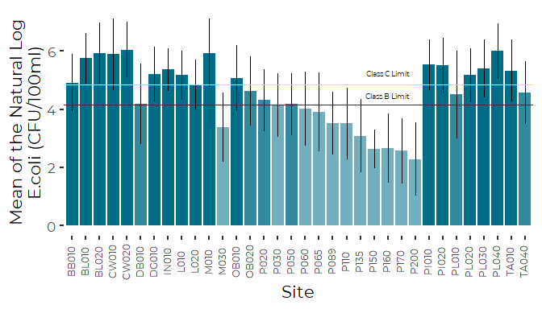

``` r

ggsave('figures/geom_means_by_site.pdf',
       device = cairo_pdf, width = 7, height = 5)
```

What that shows is the assumptions of pooled variances for calculating
error bars is not wildly unreasonable. While a few sites are more
variable, variation at all sites are within a factor of one and one half
to two or so. There is no indication that (on the log scale) sites with
higher concentrations of bacteria have higher standard deviations too.
