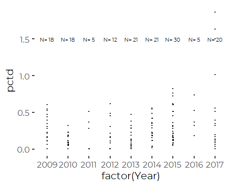
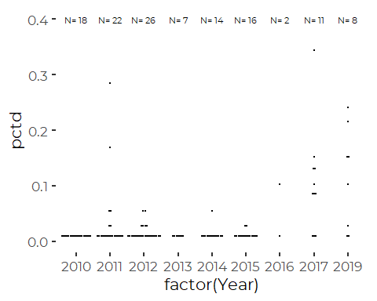
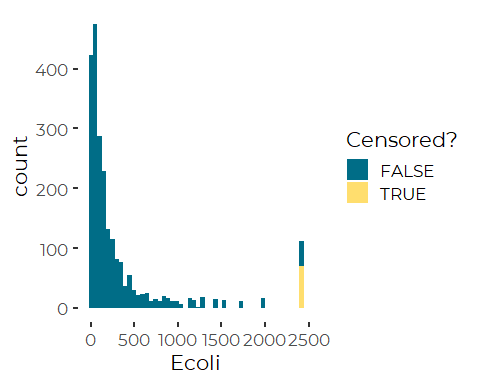
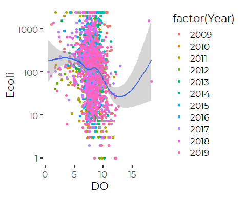
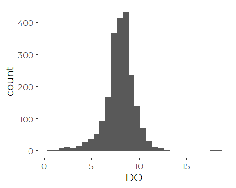
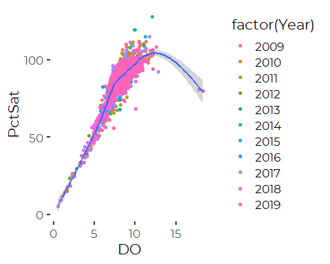

Data QA/QC Notebook on CORRECTED Raw Data
================
Curtis C. Bohlen, Casco Bay Estuary Partnership
12/24/2020

  - [Introduction](#introduction)
  - [Import Libraries](#import-libraries)
  - [Import Data](#import-data)
  - [Data Prevalence](#data-prevalence)
      - [*E.coli* Data by Year](#e.coli-data-by-year)
      - [DO Data by Year](#do-data-by-year)
      - [Number of Sites per Year](#number-of-sites-per-year)
  - [Create a “Surface Water Only” Data
    Set](#create-a-surface-water-only-data-set)
  - [Analysis of Duplicates](#analysis-of-duplicates)
      - [*E. coli* Data](#e.-coli-data)
      - [DO Data](#do-data)
  - [Data Evaluation](#data-evaluation)
      - [E Coli QA/QC Review](#e-coli-qaqc-review)
          - [Histograms](#histograms)
      - [Plotting Relationship with DO](#plotting-relationship-with-do)
      - [DO QA/QC Review](#do-qaqc-review)


# Introduction

This notebook carries out some basic data QA/QC checks on the raw data.
This version runs the QA/QC checks on the CORRECTED data.

Note that this is based on analyzing the data already reorganized
according to the code in the “Data\_Reorganization\_2.Rmd” R notebook.

# Import Libraries

``` r
library(readr)
library(tidyverse)
#> -- Attaching packages --------------------------------------- tidyverse 1.3.0 --
#> v ggplot2 3.3.2     v dplyr   1.0.2
#> v tibble  3.0.4     v stringr 1.4.0
#> v tidyr   1.1.2     v forcats 0.5.0
#> v purrr   0.3.4
#> -- Conflicts ------------------------------------------ tidyverse_conflicts() --
#> x dplyr::filter() masks stats::filter()
#> x dplyr::lag()    masks stats::lag()

library(CBEPgraphics)
load_cbep_fonts()
theme_set(theme_cbep())
```

# Import Data

``` r
sibfldnm <- 'Derived_Data'
parent <- dirname(dirname(getwd()))               # actually a grandparent
sibling <- paste(parent,sibfldnm, sep = '/')
fn <- 'presumpscot_CORRECTED.csv'

presumpscot_data <- read_csv(file.path(sibling, fn),
    col_types = cols(Ecoli = col_double(),
                     X1 = col_skip()))
#> Warning: Missing column names filled in: 'X1' [1]

presumpscot_data <- presumpscot_data %>%
  select (-Time) %>%
  mutate(Month = factor(as.numeric(format(Date, '%m')),
                        labels = month.abb[5:9]))  # Note that as.numeric()
                                                   # will not give month number
```

# Data Prevalence

## *E.coli* Data by Year

``` r
presumpscot_data %>%
  group_by(Site, Year)%>%
  summarize(n=sum(! is.na(Ecoli)))%>%
  spread(Year, n)
#> `summarise()` regrouping output by 'Site' (override with `.groups` argument)
#> # A tibble: 47 x 12
#> # Groups:   Site [47]
#>    Site  `2009` `2010` `2011` `2012` `2013` `2014` `2015` `2016` `2017` `2018`
#>    <chr>  <int>  <int>  <int>  <int>  <int>  <int>  <int>  <int>  <int>  <int>
#>  1 BB010      5      7      6      7      8      9      8     NA      9      9
#>  2 BL010     NA     NA      7      8      7      9      8      2     10      9
#>  3 BL020     NA     NA     NA     NA     NA     NA     NA     NA      8     10
#>  4 CW010     NA     NA      7      9      8      9      7      2      3     10
#>  5 CW020     NA     NA      3     NA     10     10      7      2      4     10
#>  6 DB010      6      7      6      6      8      9      8      7     10      6
#>  7 DG010      7      2      6     NA      8     10      8      5     11      7
#>  8 IN010     NA     NA      8      8     NA     NA     NA     NA      9      8
#>  9 L010       6      6      6     10     NA     10      8      9     11     10
#> 10 L020       4      4      5     NA     NA     NA     NA     NA      3      7
#> # ... with 37 more rows, and 1 more variable: `2019` <int>
```

## DO Data by Year

``` r
presumpscot_data %>%
  group_by(Site, Year)%>%
  summarize(n=sum(! is.na(DO)))%>%
  spread(Year, n)
#> `summarise()` regrouping output by 'Site' (override with `.groups` argument)
#> # A tibble: 47 x 12
#> # Groups:   Site [47]
#>    Site  `2009` `2010` `2011` `2012` `2013` `2014` `2015` `2016` `2017` `2018`
#>    <chr>  <int>  <int>  <int>  <int>  <int>  <int>  <int>  <int>  <int>  <int>
#>  1 BB010      6      6      7      6      8      8      7     NA      9      8
#>  2 BL010     NA     NA      8      8      8      8      8      2     10      9
#>  3 BL020     NA     NA     NA     NA     NA     NA     NA     NA      9      9
#>  4 CW010     NA     NA      8      9      9      8      8      2      5     10
#>  5 CW020     NA     NA      3     NA      8      9      8      2      6     10
#>  6 DB010      7      7      6      3      8      8      2      7      3      6
#>  7 DG010      6      1      7     NA      8     10      8      5     12      7
#>  8 IN010     NA     NA      8      8     NA     NA     NA     NA      6      8
#>  9 L010       7      5      7      9     NA     10      8      8      1      9
#> 10 L020       6      4      7     NA     NA     NA     NA     NA      1      7
#> # ... with 37 more rows, and 1 more variable: `2019` <int>
```

Apparently, a total of 47 locations have been sampled by PRW since 2009.
The normal sampling plan in each year is to sample a fixed number of
Saturdays, usually eight. We often see more than eight sample records at
a site within a year. Generally this is because QA/QC replicate samples
were collected, or DO data were collected at different depths on one
sample date. Multiple depth samples were only collected in 2011, 2012,
and 2013.

Prior analysis has shown little effect of sample depth. There sometimes
are substantial differences in observed *E. coli* values for replicate
samples, expressed as a percent difference. On a log scale, however, the
differences are less apparent.

## Number of Sites per Year

``` r
presumpscot_data %>%
  group_by(Year, Site)%>%
  summarize(n=sum(! is.na(DO)))%>%
  summarize(nsites = sum(n>0))
#> `summarise()` regrouping output by 'Year' (override with `.groups` argument)
#> `summarise()` ungrouping output (override with `.groups` argument)
#> # A tibble: 11 x 2
#>     Year nsites
#>    <dbl>  <int>
#>  1  2009     27
#>  2  2010     27
#>  3  2011     25
#>  4  2012     21
#>  5  2013     22
#>  6  2014     23
#>  7  2015     23
#>  8  2016     16
#>  9  2017     34
#> 10  2018     40
#> 11  2019     39
```

# Create a “Surface Water Only” Data Set

Note that this is not necessary for E.Coli, but is helpful for analyzing
the DO data

``` r
surface_data <- presumpscot_data %>%
  filter(is.na(Depth) | Depth == 0)
```

``` r
cat('All Data\n')
#> All Data
a <- with(presumpscot_data, cbind(length(Ecoli),
                             sum(! is.na(Ecoli)),
                             sum(! is.na(DO))))
colnames(a) <- c('N', 'E.coli', 'DO')
a
#>         N E.coli   DO
#> [1,] 2582   2328 2240

cat('Surface Data\n')
#> Surface Data
a <- with(surface_data, cbind(length(Ecoli),
                         sum(! is.na(Ecoli)),
                         sum(! is.na(DO))))
colnames(a) <- c('N', 'E.coli', 'DO')
a
#>         N E.coli   DO
#> [1,] 2480   2328 2138
rm(a)
```

We lose approximately 100 samples, all affecting DO samples, not *E.
coli* samples.

# Analysis of Duplicates

This is for QA/QC purposes. We may want to look at variation among
duplicates.

## *E. coli* Data

``` r
duplicates = presumpscot_data %>%
  group_by(Date, Site) %>%
  mutate(nColi= sum(!is.na(Ecoli))) %>%
  ungroup() %>%
  filter(nColi>1) %>%
  mutate(SampleID = paste0(Site,'.',Date)) %>%
  arrange(Date) %>%
  select(SampleID, Site, Date, Year, Month, Ecoli, Flag, DO, PctSat)
```

``` r
diffs <- duplicates %>%
  group_by(SampleID) %>%
  summarize(Year = min(Year),
            m = (max(Ecoli, na.rm=TRUE)+min(Ecoli, na.rm=TRUE))/2,
            d= max(Ecoli, na.rm=TRUE)-min(Ecoli, na.rm=TRUE),
            pctd = d/m)
#> `summarise()` ungrouping output (override with `.groups` argument)
  summary(diffs)
#>    SampleID              Year            m                 d         
#>  Length:150         Min.   :2009   Min.   :   3.60   Min.   :   0.0  
#>  Class :character   1st Qu.:2011   1st Qu.:  36.85   1st Qu.:   4.8  
#>  Mode  :character   Median :2014   Median : 143.38   Median :  20.1  
#>                     Mean   :2013   Mean   : 333.84   Mean   :  82.9  
#>                     3rd Qu.:2015   3rd Qu.: 326.23   3rd Qu.:  78.2  
#>                     Max.   :2017   Max.   :2419.60   Max.   :1119.5  
#>       pctd       
#>  Min.   :0.0000  
#>  1st Qu.:0.1028  
#>  Median :0.1895  
#>  Mean   :0.2709  
#>  3rd Qu.:0.3597  
#>  Max.   :1.8651
```

So, that shows that there are sometimes differences that are extremely
large. A better analysis might be of logs of abundance, given the heavy
skew of the observed data.

``` r
ns = diffs %>%
  group_by(Year) %>%
  summarize(n=n()) %>%
  mutate(n2 = paste("N=", n))
#> `summarise()` ungrouping output (override with `.groups` argument)

ggplot(diffs, aes(factor(Year), pctd)) + 
 # geom_boxplot() +
  geom_dotplot( stackdir = "center",
                binaxis = 'y',
                binwidth = .01,
                binpositions="all",
                #position = 'dodge',
                dotsize = .5) +
  geom_text(aes(label=n2, x=factor(Year), y=1.5 ), data=ns, size = 3)
```


So, the most extreme variation came from year 2017, and there were no
*E. coli* duplicates in 2018, and 2019.

Given the skewed nature of the *E. coli* data, these high percent
differences are not dreadful, but they don’t make anyone happy either. A
percent difference of more than 150%, as observed three times in 2017,
is problematic.

The lack of duplicate data from 2018 reflects manua ldata handling by
PLT. Toby Jacobs reports transferring data from a spreadsheet used
principally for mapping purposes, which did not include field
replicates. The field replicates were apparently collected, just not
shared with us.

## DO Data

``` r
duplicates = presumpscot_data %>%
  group_by(Date, Site) %>%
  mutate(nDO= sum(!is.na(DO))) %>%
  ungroup() %>%
  filter(nDO>1) %>%
  mutate(SampleID = paste0(Site,'.',Date)) %>%
  arrange(Date) %>%
  select(SampleID, Site, Date, Year, Month, DO, PctSat)
```

``` r
diffs <- duplicates %>%
  group_by(SampleID) %>%
  summarize(Year = min(Year),
            m = (max(DO, na.rm=TRUE)+min(DO, na.rm=TRUE))/2,
            d= max(DO, na.rm=TRUE)-min(DO, na.rm=TRUE),
            pctd = d/m)
#> `summarise()` ungrouping output (override with `.groups` argument)
  summary(diffs)
#>    SampleID              Year            m                d         
#>  Length:124         Min.   :2010   Min.   : 2.300   Min.   :0.0000  
#>  Class :character   1st Qu.:2011   1st Qu.: 7.272   1st Qu.:0.0100  
#>  Mode  :character   Median :2012   Median : 7.827   Median :0.0500  
#>                     Mean   :2013   Mean   : 7.920   Mean   :0.2294  
#>                     3rd Qu.:2015   3rd Qu.: 8.599   3rd Qu.:0.1400  
#>                     Max.   :2019   Max.   :10.975   Max.   :3.7700  
#>       pctd         
#>  Min.   :0.000000  
#>  1st Qu.:0.001449  
#>  Median :0.006069  
#>  Mean   :0.028653  
#>  3rd Qu.:0.019148  
#>  Max.   :0.343508
```

So, replicate DO data shows only moderate variation, usually under 1%,
with just a handful of replicates with higher percent differences, and
none over 4%.

``` r
ns = diffs %>%
  group_by(Year) %>%
  summarize(n=n()) %>%
  mutate(n2 = paste("N=", n))
#> `summarise()` ungrouping output (override with `.groups` argument)

ggplot(diffs, aes(x = factor(Year), y = pctd)) +
  geom_dotplot( stackdir = "center",
                binaxis = 'y',
                binwidth = .02,
                binpositions="all",
                #position = 'dodge',
                dotsize = .15) +
  geom_text(aes(label=n2, x=factor(Year), y=0.4), data=ns, size = 3)
```


Just like for the E coli data, percent differences have been greater
since 2017.

# Data Evaluation

## E Coli QA/QC Review

### Histograms

``` r
plt <- ggplot(presumpscot_data, aes(Ecoli)) +
  geom_histogram(aes(fill = Flag), bins=50) +
  scale_fill_manual(values = cbep_colors(), name = 'Censored?')
  #geom_density()
plt
#> Warning: Removed 254 rows containing non-finite values (stat_bin).
```


Notice that the values, while conceptually continuous are converted to
select discrete values by the MPN method used. Technically this is
interval censored data, but there are so many categories that the impact
on analysis is probably small.

The number of “uncensored” large values looks implausibly high, and a
close look shows that several slightly different values are all included
with NEARLY identical values. I suspect that reflects different coding
practices over time. Again, differences are too small to matter for any
quantitative analysis, so we leave all observations as is.

``` r
plt  + scale_x_log10()
#> Warning: Removed 254 rows containing non-finite values (stat_bin).
```


We have a fat tailed mound-like distribution, which suggests a lognormal
distribution may work well for these data. But note also that we have an
excess of elevated values, if we think this follows a lognormal
distribution. An alternative is a Pareto Distribution, which also fits
these data fairly well. The Pareto predicts more extreme values than the
lognormal. (See analysis notebooks for more detail).

## Plotting Relationship with DO

We are looking here for any outliers.

``` r
plt <- ggplot(surface_data, aes(DO, Ecoli)) + geom_point(aes(color=factor(Year))) + geom_smooth() +
  scale_y_log10()
plt
#> `geom_smooth()` using method = 'gam' and formula 'y ~ s(x, bs = "cs")'
#> Warning: Removed 481 rows containing non-finite values (stat_smooth).
#> Warning: Removed 481 rows containing missing values (geom_point).
```


Other than a few extreme DO values, there is nothing obviously amiss
here. There is an indication that higher DO is associated with lower *E.
coli*, as might be expected if summer low flows and high temperatures
are bad for both dissolved oxygen and bacteria loads. We can do little
more with this based on these data because we lack temperature data for
2018 and 2019.

## DO QA/QC Review

``` r
plt <- ggplot(surface_data, aes(x = DO)) +
  geom_histogram()
plt
#> `stat_bin()` using `bins = 30`. Pick better value with `binwidth`.
#> Warning: Removed 342 rows containing non-finite values (stat_bin).
```



We notice a few implausible high DO observations.

``` r
plt <- ggplot(surface_data, aes(DO, PctSat)) + geom_point(aes(color =factor(Year))) + geom_smooth()
plt
#> `geom_smooth()` using method = 'gam' and formula 'y ~ s(x, bs = "cs")'
#> Warning: Removed 440 rows containing non-finite values (stat_smooth).
#> Warning: Removed 440 rows containing missing values (geom_point).
```


Note a handful of observations that are far from the trend line. After
correction, we retained only a couple of high PctSat values from 2014
and a couple of elevated OA observations from 2018 and 2019.

``` r
anomolies <- surface_data %>%
  filter((PctSat>75 & (DO<6 | DO>13)) | (PctSat<25 & DO>4 ) | PctSat>115) %>%
  select(-Name, -QC, -Depth, -Flag, -Month)
anomolies
#> # A tibble: 5 x 7
#>   Site   Year Date        Temp    DO PctSat  Ecoli
#>   <chr> <dbl> <date>     <dbl> <dbl>  <dbl>  <dbl>
#> 1 M030   2014 2014-07-12  24.4  9.96  119.    42.2
#> 2 M030   2014 2014-07-12  24.5  9.92  119.    43.5
#> 3 PI020  2014 2014-07-12  18.2 12.0   128.   102. 
#> 4 CW020  2018 2018-07-29  NA   17.8    80.8 1553. 
#> 5 PL045  2019 2019-06-01  NA   18.3    80     61.3
#write.csv(anomolies,"anomolies.csv")
```

We have been unable to confirm errors in any of these values.

It appears possible that the anomalous values from  
\* CW020, 07/29/2018  
\* PL045 06/01/2019 reflect simple transcription errors where a “1” got
added in front of the correct DO value, but teh error is present in all
versions of the data we have reviewed. We leave those points in the CSV
data, but recommend removing the DO values before conducting any
analyses.

We have no hypothesis for what may have happened in 2014, but we
recommend deleting the percent saturation data for those saples.
